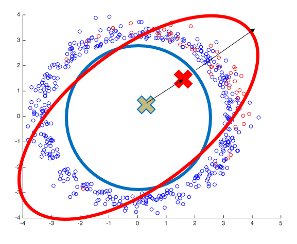

# Fast mean estimation and outlier detection

This repo contains code for our paper **Quantum Entropy Scoring for Fast Robust Mean Estimation and Improved Outlier Detection**.


Description of select scripts:
* [`mean.py`](mean.py) contains the backbone of the experimental setup and evaluation.
* [`utils.py`](utils.py) contains various utilities methods, such as fast JL computation.
* Auxiliary scripts specific to certain experiments: [`pixel.py`](pixel.py) used for running the hot pixels experiments on CIFAR data, [`words.py`](words.py) used when running word embeddings experiments.

The [data](data) directory contains select data for running the experiments. [GloVe embeddings can be downloaded here](https://nlp.stanford.edu/projects/glove/). [CIFAR images can be downloaded from here](https://www.cs.toronto.edu/~kriz/cifar.html).


The main script [mean.py](mean.py) with appropriate arguments. For instance, to run experiments on synthetic data with respect to varying alpha:
```
python mean.py --experiment_type syn_lamb
```

And the same on word embeddings data:
```
python mean.py --experiment_type text_lamb
```

To run experiments on CIFAR images:
```
python pixel.py --experiment_type image_lamb
```

For more available runtime options see:
```
python mean.py -h
```
<p>

</p>